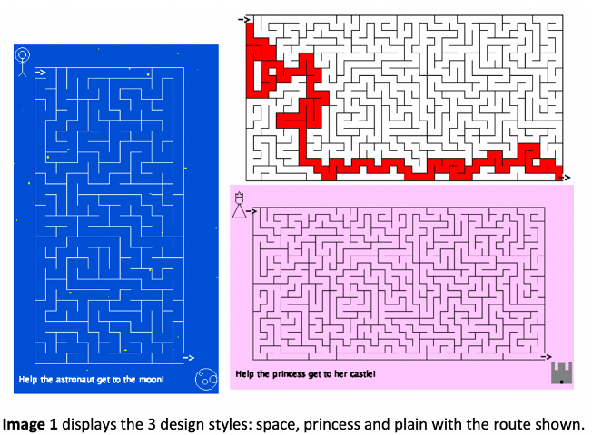
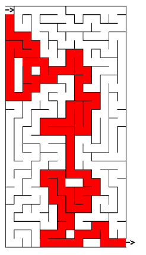

# C-Maze
To run my maze use the following commands:
Gcc cmaze.c graphics.c
./a.out | java -jar drawapp.jar

There are 3 different themes/visual styles: princess, space and plain. The default is plain but you can change the visual style of the maze when running the program by typing “princess” or “space” after ./a.out.
(e.g. ./a.out princess | java -jar drawapp.jar). 

You can display the route by additionally adding the word show. Note: this must come after the theme if wanting both (./a.out princess show | java -jar drawapp.jar) and all must be in lowercase. 

If you’d like to change the default settings for the canvas size or ‘difficulty’, compile and run the file setup.c. The user then has to follow the instructions to input their settings; This then updates the header file containing definitions for canvas height, canvas width and grid size. 

I have commented out the line that seeds the random generation so that you can display a maze and then run it again with the keyword show to display the answer to the same maze pattern. Uncomment out this line (in main function) to generate a random maze every time the code is run. 

The way I have chosen to change the difficulty is to make the grid size smaller. Additionally, if medium or hard difficulties are selected, when the code is run some extra walls are removed to create more path intersections choices. Although on some mazes this could make it easier as it would create more paths, this makes it harder for my chosen algorithm (depth-first search with recursive backtracking, as described at https://en.wikipedia.org/wiki/Maze_generation_algorithm) because, as you can see from the image on the right, although it can create complex paths, often they are quite simple routes like following one corridor (as it explores each route extensively before backtracking, and thus has a low branching factor).

